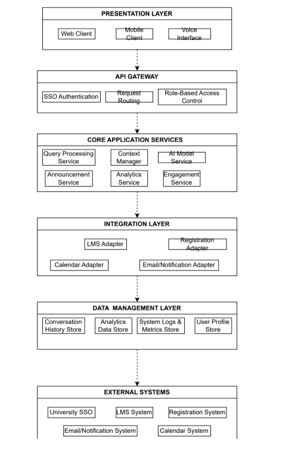

Include in this file the 7 steps for Iteration 1
## STEP 1 [Review Inputs]

## 1.1 Primary Functional Drivers [Use Cases]

|Use Case|Description|Associated Requirement ID|
|--------|-----------|-------------------------|
|UC-1:Student Query & System Answer|The Student Asks the system a question, the system interprets the query, then generates a response using both stored knowledge and live data.|RS1, R5, R6|
|UC-2: Lecturer Announcement to Students|The Lecturer requests to send a new announcement to their students, the systems authorizes the Lecturer's access, interprets the update, then notifies the students.| R5, RL1, RL2, RL8, RA5|
|UC-3: Lecturer Views Course Analytics Summary|The Lecturer requests a summary of their course analytics, the system interprets the query, retrieves the relevant secure data (grades, attendance, student engagment), then presents the summarized results.| RL3, RL6, R3, R4, R6, R8|
|UC-4: Administrator Broadcasts Campus-Wide Announcement|The Administrator broadcasts an announcement, the system verifies Administrator access, sends the message to the Students and Lecturers, then confirms message delivery.|RA3, RA5, R3, R4, R8, RS2|
|UC-5: Lecturer Informs Students of Low Engaement|The System detects low student engagemnet and notifies the Lecturer, the Lectuerer responds by sending a message to their students addressing the issue and encouraging participation, then the Students recieve the message through the System.| RL7, RS2, R6|
|UC-6: Administrator Recovers Data for Users|The Administrator initiates a system recovery after a system failure, restoring data and access for the Lecturers and Students, ensuring continued support and interaction without disruption.|RA6, RM6, R7, RA5|

## 1.2 Quality Attribute Drivers

|ID|Quality Attribute|Scenario|Associated Use Case|
|--|-----------------|--------|-------------------|
|**QA-1**|**Performance**|The System responds to Student queries within 2 seconds on avergae under normal load.|UC-1|
|**QA-2**|**Security**|Only system authorized Lecturers can send annoucements to their respective courses.|UC-2|
|**QA-3**|**Usability**|The System's user interface and conversational design present student-related analytics in a clear, intuitive, and organized format allowing Lecturers to easily request and interpret data.|UC-3|
|**QA-4**|**Maintainability**|The System allows Administators and System Maintainers to deploy updates and monitoring tools continuously without disrupting user interaction|UC-5|
|**QA-5**|**Availability**|The System maintains a minimum of 99.5% available uptime duirng the academic year to ensure dependable service access.|UC-6|

## 1.3 Constraints

- Cloud-native deployment
- REST or GraphQL used for external integrations
- Must use university Single Sign-On (SSO)
- Supports both text and voice interaction
- Average response time must be within 2 seconds
- Handles up to 5,000 concurrent users
- Supports multiple languages
- Accessible on web, mobile, and voice-enabled devices

## 1.4 Architectural Concerns
- AI model versioning and configuration
- Stability of external integrations and retry mechanisms
- Role-based access for students, lecturers, and administrators
- Handling of user context using both live and historical data
- Data privacy and secure storage of user information
- Monitoring of latency, accuracy, logs, and system metrics
- Fault tolerance and error recovery during service failures
- Scalability to maintain performance under peak load
- Efficient use of resources to manage cloud costs

## STEP 2 [Establish Iteration Goal]

THe goal of Iteration 1 is to establish a high level architecture for AIDAP and define the system structure at a broad level. This iteration focuses on main functions that will impact how the platform operates and behaves. 

Specifically this Iteration will focus on:
- Identifying a suitable reference architecture for AIDAP

- Breaking the system into major layers and components

- Addressing core use cases (UC-1, UC-2, UC-3, UC-4, UC-6)

- Considering key quality attributes like performance, availability, security, usability, and maintainability

- Producing the initial logical architecture and deployment views

- Assigning responsibilities to each high-level component

By the end of this iteration, the system should have a clear architectural foundation. This will be refined in Iteration 2 when domain-specific components and detailed interactions are introduced.

## STEP 3 [Choose Elements of the System to Decompose]

In Iteration 1, the AIDAP system is decomposed at a high level to establish the architectural areas for the primary use cases and quality attributes identified in Step 1. the goal is to break the system into its core layers and subsystems.

The system is decomposed into the following parts:

- Presentation Layer: Web interface, mobile app, and voice/assistant interface used by students, lecturers, and administrators.

- API Gateway / Entry Point: Central access point handling SSO authentication, request routing, and security enforcement.

- Core Application Services Layer: High-level backend services such as conversational/query processing, AI model interaction, context handling, announcements, analytics, and engagement monitoring.

- Integration Layer: Components that connect AIDAP to external systems including LMS, Registration, Calendar, and Email services through REST/GraphQL APIs.

- Data Management Layer: Storage components for conversation history, user profiles and preferences, analytics data, logs, and system metrics.

- External Systems: University SSO provider, LMS, registration system, academic calendar system, email server, and notification services.

## STEP 4 [Choose Design Concepts That Satisfy the Selected Drivers]

The purpose of this step is to select design concepts that will guide how the high-level components identified in Step 3 should be structured. These concepts need to support the main use cases (UC-1 to UC-6), system constraints, and the quality attributes prioritized in Step 1.

# 4.1 Presentation Layer

Design Concepts:

Thin client interfaces for web and mobile.

Clear separation between UI and backend logic.

Optional support for voice-enabled devices as required by system constraints.

Reason:
This supports multi-platform access, usability, and keeps complex logic on the server side for better performance and maintainability.

# 4.2 API Gateway / Entry Point

Design Concepts:

API Gateway pattern as a single controlled entry point.

Centralized authentication through the university’s SSO provider.

Routing, access control, and basic request validation.

Reason:
This aligns with the SSO requirement, improves security, and simplifies how different clients communicate with backend services.

# 4.3Core Application Services

Design Concepts:

Service-oriented structure with separate modules (query processing, AI model service, announcements, analytics, engagement monitoring).

Stateless service design to enable horizontal scaling.

Support for asynchronous operations when necessary (e.g., analytics).

Reason:
This helps with performance, availability, and maintainability, and it maps directly to the main system use cases.

# 4.4 Integration Layer

Design Concepts:

Adapter pattern for LMS, Registration, Calendar, and Email systems.

Single integration facade that backend services interact with.

Retry and timeout logic for external service faults.

Reason:
This ensures compatibility with required REST/GraphQL data sources and increases reliability when external systems fail or lag.

# 4.5 Data Management Layer

Design Concepts:

Repository/Data Access patterns for conversation history, user profiles, analytics, and logs.

Logical separation of operational data, analytics data, and system metrics.

Caching for frequently accessed academic and schedule information.

Reason:
This supports persistence requirements, improves performance, and keeps data concerns cleanly separated.

# 4.6 External Systems (Boundary)

Design Concepts:

Clearly modeled as external dependencies in the architecture.

Use of standard protocols like REST/GraphQL and SSO standards.

Loose coupling via adapters rather than direct internal integration.

Reason:
This defines system boundaries, reduces coupling, and makes the architecture more adaptable to changes in external university systems.

## STEP 5 [Instantiate Architectural Elements, Allocate Responsibilities, and Define Interfaces]

Based on the decomposition from Step 3 and the design concepts selected in Step 4, the following high-level architectural elements are instantiated for Iteration 1. Each component is assigned its main responsibilities and the general interfaces it exposes. These elements form the foundation of the AIDAP architecture and will be refined further in Iteration 2.

---

## 5.1 Presentation Layer

### Components and Responsibilities
| Component | Responsibilities |
|----------|------------------|
| **Web Client** | Provides the main user interface for Students, Lecturers, and Administrators; sends requests to the API Gateway. |
| **Mobile Client** | Offers mobile access to system features; communicates with the API Gateway. |
| **Voice/Assistant Interface** | Supports voice-based commands and passes them to backend services (as required by system constraints). |

---

## 5.2 API Gateway / Entry Point

### Component and Responsibilities
| Component | Responsibilities |
|----------|------------------|
| **API Gateway** | Handles SSO authentication, validates requests, applies role-based access control, and routes calls to backend services. |

---

## 5.3 Core Application Services Layer

### Components and Responsibilities
| Component | Responsibilities |
|----------|------------------|
| **Query Processing Service** | Interprets user queries, coordinates with AI Model Service and Context Manager, and returns structured responses. |
| **AI Model Service** | Sends natural language input to an AI/LLM model and returns intent/meaning. |
| **Context Manager** | Retrieves and updates conversation history and user preferences. |
| **Announcement Service** | Validates lecturer permissions, posts announcements, and triggers notifications. |
| **Analytics Service** | Collects and summarizes course analytics through integration adapters. |
| **Engagement Monitoring Service** | Detects low engagement patterns and triggers alerts to lecturers. |

---

## 5.4 Integration Layer

### Components and Responsibilities
| Component | Responsibilities |
|----------|------------------|
| **LMS Adapter** | Communicates with the LMS to retrieve course content and analytics inputs. |
| **Registration Adapter** | Fetches enrollment information for courses and users. |
| **Calendar Adapter** | Retrieves academic calendar events and deadlines. |
| **Email/Notification Adapter** | Sends emails or notifications through campus messaging systems. |

### Interfaces
- REST/GraphQL calls to LMS  
- REST/GraphQL calls to Registration  
- REST/GraphQL calls to Calendar  
- Email/Notification API calls  

---

## 5.5 Data Management Layer

### Components and Responsibilities
| Component | Responsibilities |
|----------|------------------|
| **User Profile Store** | Stores user preferences, language settings, and notification configurations. |
| **Conversation History Store** | Saves past queries and responses for personalization. |
| **Analytics Data Store** | Stores processed analytics and engagement metrics. |
| **System Logs & Metrics Store** | Captures logs and performance data for monitoring. |

---

## 5.6 External Systems (Boundary)

### External Dependencies
| External System | Purpose |
|-----------------|---------|
| **University SSO** | Authenticates users before they access the system. |
| **LMS System** | Supplies course materials and analytics data. |
| **Registration System** | Provides enrollment data. |
| **Calendar System** | Provides academic dates and schedule events. |
| **Email/Notification System** | Delivers announcements and alerts. |

---

## 5.7 Summary

These instantiated architectural elements reflect the major components needed to support the key use cases and constraints identified earlier. Responsibilities are separated to improve performance, maintainability, and security. More detailed domain-specific components and interfaces will be defined in Iteration 2.

## STEP 6 [Sketch Views and Record Design Decisions]

## 6.1 Logical Architecture View

The logical view summarizes the high-level structure of AIDAP based on the layers defined earlier.

- **Presentation Layer:** Web client, mobile client, voice interface  
- **API Gateway:** SSO authentication, routing, RBAC  
- **Core Application Services:** Query processing, AI model service, context manager, analytics, announcement service, engagement monitoring  
- **Integration Layer:** LMS Adapter, Registration Adapter, Calendar Adapter, Email/Notification Adapter  
- **Data Management Layer:** User profiles, conversation history, analytics data, system logs  
- **External Systems:** University SSO, LMS, Registration, Calendar, Notification services  

The logical diagram created for this iteration confirms that responsibilities are separated across layers and that each component aligns with the architectural drivers from Step 1.

---

## 6.2 Sequence Diagrams

High-level sequence diagrams were created to check that the architecture supports the main interactions of the system.

### UC-1: Student Query & System Answer
Validates that a student query flows through:
API Gateway → Application Server → Data Storage → External Systems → back to the student.  
This confirms support for retrieving stored context and live academic data.

### UC-2: Lecturer Announcement
Shows the lecturer submitting an announcement, the system verifying permissions through SSO, and the Application Server sending the message to the Notification Service.  
Confirms that write operations and permission checks occur at the correct layers.

## 6.3 Deployment View

The deployment view shows how the major parts of AIDAP run in the cloud environment.  
The diagram includes:

- **Client Devices:** Web browser, mobile app, and voice device.
- **Load Balancer:** Routes incoming requests to the API Gateway.
- **API Gateway:** Central entry point for routing and access control.
- **Application Servers:** Two backend servers running the core application services.
- **Data Storage:** User profiles, conversation history, analytics data, and system logs.
- **External University Systems:** SSO, LMS, Registration, Calendar, and Notification services.

This view confirms that the system can scale horizontally, integrate with university systems, and support the performance and availability requirements defined in Step 1.

## STEP 7 [Perform Analysis of the Current Design and Review Iteration Goal]

This architecture was checked against the drivers identified in Step 1 to confirm that the major requirements are supported.

- **Use Cases:** The logical and deployment views show that the system can handle the main flows such as student queries, lecturer announcements, and analytics retrieval.  
- **Quality Attributes:** The layered structure, API Gateway, and scalable deployment support performance, availability, security, maintainability, and usability.  
- **Constraints:** The design aligns with cloud-native deployment, SSO integration, REST/GraphQL requirements, multi-platform access, and support for 5,000 concurrent users.  
- **Architectural Concerns:** Integration adapters, clear service boundaries, and separate data stores address concerns around modifiability, external system reliability, context management, and monitoring.

Based on these checks, the goal of Iteration 1—to establish the high-level architecture and validate it against the system drivers—was met. More detailed component-level design and lower-level interactions will be addressed in Iteration 2.

